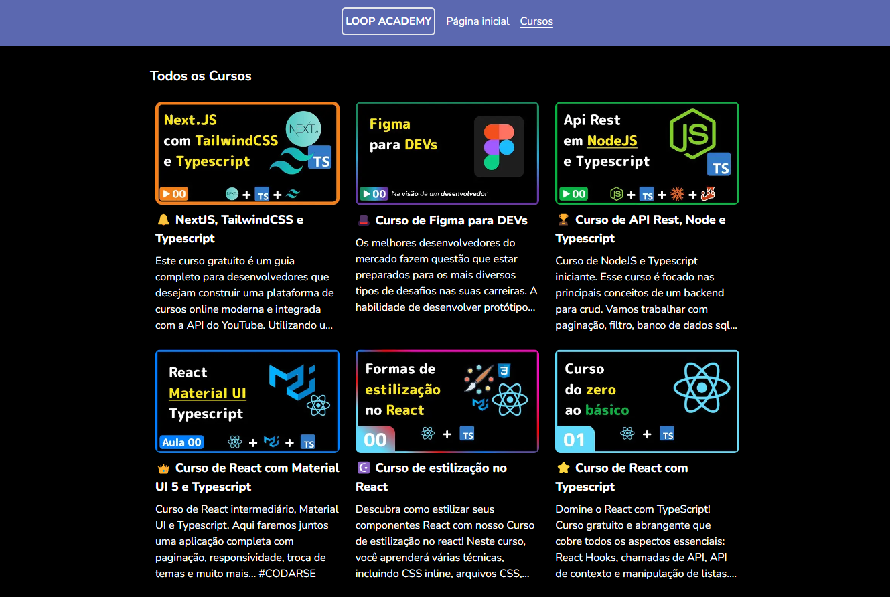

# Loop Academy

## 📖 Descrição do projeto

A **Loop Academy** é uma plataforma de cursos gratuitos encontrados no Youtube, como foco em conteúdos de programação. O objetivo é concentrar diversos cursos gratuitos numa plataforma só.

## 🚀 Tecnologias

Feito com ❤️ por <a href="https://tiagolopes.vercel.app" target="_blank">Tiago Lopes</a>